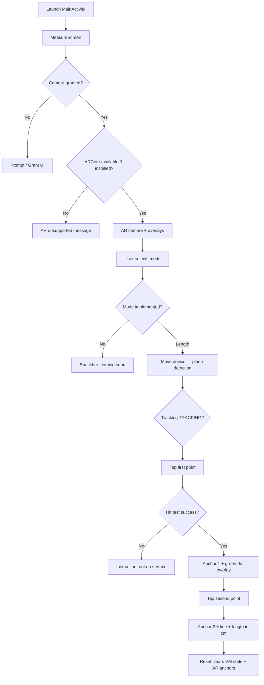

# MeasureAR — Implementation Specification

**Package:** `com.example.measurear`  
**Platform:** Android (minSdk 24, target/compileSdk 36)  
**Version:** 1.0 (versionCode 1)  
**Last documented:** October 2025  

---

## 1. Product overview

MeasureAR is a portrait-only Android app that uses **Google ARCore** to measure **straight-line distance** between two points the user taps on real-world surfaces. The live camera feed is rendered with OpenGL; measurement markers and a connecting line are drawn in a Jetpack Compose overlay on top.

**Implemented today**

| Mode     | Status        |
|----------|---------------|
| Length   | Fully implemented |
| Area     | UI only (“coming soon”) |
| Diameter | UI only (“coming soon”) |
| Height   | UI only (“coming soon”) |

**Hard requirements (manifest)**

- `CAMERA` permission
- `android.hardware.camera` (required)
- `android.hardware.camera.ar` (required)
- ARCore meta-data: `com.google.ar.core` = `required`

---

## 2. End-to-end user flow



### Step-by-step (happy path — Length mode)

1. **App start** — `MainActivity` enables edge-to-edge, applies `MeasureARTheme`, hosts `MeasureScreen`.
2. **Permissions** — On first launch, `MeasureScreen` requests `CAMERA` if missing. Without permission, a centered message and “Grant camera access” button are shown; the AR viewport is hidden.
3. **ARCore readiness** — After camera permission:
   - `ArCoreApk.checkAvailability()`; unsupported devices set `isArSupported = false`.
   - Transient availability is polled until stable.
   - `requestInstall(activity, true)` may prompt ARCore install/update; success sets `isArSupported = true`.
4. **Session & camera** — When supported and permitted, `ArMeasurementViewport` shows:
   - Bottom layer: `ArMeasureSurfaceView` (GL + ARCore session).
   - Middle: `MeasurementOverlayCanvas` (dots, line, tap ripple).
   - Top: `MeasureTouchCaptureLayer` (tap gestures).
5. **Instructions** — Bottom panel guides the user:
   - Initially: detect surfaces (`DETECT_SURFACES`).
   - When camera tracking is `TRACKING` and no points placed: tap first point.
   - After first anchor: tap second point.
   - After two anchors: measurement complete; length shown as `"X.X cm"`.
6. **Placement** — Taps are only processed when `isPlacementEnabled` is true (AR supported **and** selected mode is `LENGTH`). Each tap is clamped to the surface view bounds and queued on the GL thread.
7. **Hit testing** — On the next frame, `ArHitTester` resolves a 3D hit; an **anchor** is created at the hit pose. After two anchors, **Euclidean 3D distance** between anchor positions is computed once and stored as `fixedLengthMeters`.
8. **Visual feedback** — Every frame (while anchors exist), anchor poses are projected to screen coordinates; Compose redraws green markers and a line between them. Length text updates via `onFrameUpdated` → ViewModel → repository formatting.
9. **Reset** — “Reset” clears ViewModel measurement state and increments `clearAnchorsRequest`, which triggers `ArMeasureSurfaceView.clearAnchors()` (detach anchors, clear reference plane/distance, pending taps).

### Error / edge paths

| Condition | UI / behavior |
|-----------|----------------|
| ARCore unsupported or install declined | Center or bottom instruction: AR unsupported |
| Camera unavailable on resume | `AR_SESSION_STOPPED` instruction |
| Session paused during draw | Tracking published as `PAUSED`; draw skipped safely |
| Tap with no valid hit | `POINT_NOT_ON_SURFACE` (once per tap attempt) |
| Non-length mode selected | Placement disabled; mode chip still selectable; snackbar for unimplemented modes |
| Third tap while two anchors exist | Ignored in renderer (`MAX_ANCHORS = 2`) |

---

## 3. Architecture

The app follows a **layered structure**: Compose UI + ViewModel (presentation), domain math/types, data repository (formatting), and a dedicated **AR/OpenGL module** bridged via callbacks.

```text
┌─────────────────────────────────────────────────────────────┐
│  MainActivity → MeasureScreen (Compose)                      │
│    ├─ MeasureViewModel (StateFlow<MeasureUiState>)           │
│    ├─ MeasurementModeSelector / MeasureBottomPanel           │
│    └─ ArMeasurementViewport                                  │
│         ├─ ArMeasureSurfaceView (GLSurfaceView)              │
│         ├─ MeasurementOverlayCanvas                          │
│         └─ MeasureTouchCaptureLayer                          │
└──────────────────────────┬──────────────────────────────────┘
                           │ ArMeasureCallbacks (main thread)
┌──────────────────────────▼──────────────────────────────────┐
│  ar/                                                         │
│    ArMeasureRenderer ← BackgroundRenderer, ArHitTester       │
│    ArProjectionUtils, ArDisplayGeometry                      │
└──────────────────────────┬──────────────────────────────────┘
                           │
┌──────────────────────────▼──────────────────────────────────┐
│  domain/          data/repository/                           │
│  MeasurementCalculator, models    MeasurementRepositoryImpl  │
└─────────────────────────────────────────────────────────────┘
```

### Threading model

| Thread | Responsibility |
|--------|----------------|
| Main (UI) | Compose, ViewModel updates, ARCore session create/resume/pause on lifecycle |
| GL render | `Session.update()`, camera background draw, hit tests, anchor create, projection |
| Handoff | `ArMeasureSurfaceView` posts all `ArMeasureCallbacks` to main via `Handler` |

Tap flow: Compose `detectTapGestures` → `enqueueTap(x,y)` → atomic `pendingTap` → processed in `onDrawFrame` on GL thread → callbacks on main → ViewModel.

---

## 4. Project structure

```text
MeasurementApp/
├── app/
│   ├── build.gradle.kts          # Compose, ARCore, ViewModel deps
│   └── src/main/
│       ├── AndroidManifest.xml
│       ├── java/com/example/measurear/
│       │   ├── MainActivity.kt
│       │   ├── ar/                 # ARCore + OpenGL (no Compose)
│       │   ├── data/repository/    # Repository interface + impl
│       │   ├── domain/             # Modes, calculator, models
│       │   └── ui/
│       │       ├── measure/        # Screen, VM, state, factory
│       │       ├── measure/components/
│       │       └── theme/
│       └── res/values/strings.xml
├── app/src/test/                   # Unit tests (calculator, ViewModel)
└── gradle/libs.versions.toml       # AGP 8.11.2, Kotlin 2.0.21, ARCore 1.52.0
```

### Layer responsibilities

| Layer | Types | Role |
|-------|--------|------|
| **UI** | `MeasureScreen`, components | Permissions, ARCore install check, scaffold, wires VM ↔ viewport |
| **Presentation** | `MeasureViewModel`, `MeasureUiState`, `MeasureInstruction` | UI state, instructions, mode selection, reset |
| **Domain** | `MeasurementCalculator`, `MeasurementMode`, `WorldPoint`, `ScreenPoint` | Pure distance/format math; mode capability flag |
| **Data** | `MeasurementRepository` / `Impl` | Delegates length formatting (extension point for locale/units) |
| **AR** | `ArMeasureSurfaceView`, `ArMeasureRenderer`, helpers | Session lifecycle, rendering, anchors, hit tests |

### Unused / legacy (present in repo, not on active path)

- `ArMeasureCameraView` — alternate Compose wrapper for `ArMeasureSurfaceView`; superseded by `ArMeasurementViewport`.
- `ArTapCoordinateMapper` — window/surface coordinate mapping; not referenced (viewport passes tap offsets directly to `enqueueTap` in the same stacked layout).

---

## 5. Key types and state

### `MeasureUiState`

| Field | Source / meaning |
|-------|------------------|
| `selectedMode` | Default `LENGTH`; updated by mode chips |
| `instruction` | User guidance enum mapped to strings in bottom panel |
| `isArSupported` | Set after ARCore availability + install check |
| `projectedPoints` | Screen positions for overlay (from AR frame updates) |
| `lengthMeters` / `formattedLength` | Set after 2nd anchor + frame updates |
| `placedPoints` | Declared on state but **not populated** by current ViewModel (anchors live only in renderer) |
| `canPlaceMorePoints` | false after 2 points in length mode |
| `showComingSoonMessage` | Triggers snackbar for unimplemented modes |

### `MeasureViewModel` API

| Method | Behavior |
|--------|----------|
| `onModeSelected` | Implemented modes update selection; others set coming-soon flag |
| `setArSupported` | Sets support flag + initial instruction |
| `onPointPlaced` | Ignored unless mode is `LENGTH`; updates instruction by anchor count |
| `onFrameUpdated` | No-op if `placedPointCount == 0`; else updates projections and formatted length |
| `onTrackingStateChanged` | `TRACKING` → tap first (if no points); `STOPPED` → session stopped |
| `onPlacementFailed` / `onCameraUnavailable` | Instruction updates |
| `resetMeasurement` | Clears counts and measurement fields |

ViewModel keeps **`placedPointCount`** privately (mirrors renderer anchor count via callbacks, capped at `MAX_LENGTH_POINTS = 2`).

---

## 6. ARCore session and rendering

### Session creation (`ArMeasureRenderer.createSessionOnUiThread`)

- Requires camera permission.
- `Session(context)` with config:
  - **Focus:** AUTO
  - **Plane finding:** HORIZONTAL_AND_VERTICAL
  - **Instant placement:** LOCAL_Y_UP
  - **Depth:** DISABLED
  - **Update mode:** LATEST_CAMERA_IMAGE

### Lifecycle (`ArMeasureSurfaceView`)

- Implements `LifecycleEventObserver` via `findViewTreeLifecycleOwner()`.
- **ON_RESUME / onResume:** create session if needed, `session.resume()`, update display geometry.
- **ON_PAUSE / onPause:** mark paused, `session.pause()`.
- `preserveEGLContextOnPause = true`; continuous render mode.

### Display geometry (`ArDisplayGeometry`)

- Reads display rotation from `WindowManager`.
- Calls `session.setDisplayGeometry(rotation, width, height)` on surface change and resume.

### Draw loop (`onDrawFrame`)

1. Bind camera texture to `BackgroundRenderer` (external OES quad).
2. `session.update()` → draw camera background.
3. Publish tracking state changes.
4. Consume pending tap → hit test → optional anchor.
5. If anchors exist → project to screen → `onFrameUpdated`.

### Anchor and measurement rules

- Maximum **2** anchors per measurement (`MAX_ANCHORS`).
- **Reference plane** and **reference hit distance** from first successful placement bias subsequent hits (same plane preference, consistent instant-placement depth).
- **Length** is computed once when the second anchor is placed: 3D Euclidean distance via `MeasurementCalculator.distanceMeters` (not plane-projected distance, though `distanceOnPlaneMeters` exists for future modes).
- `fixedLengthMeters` does not change if the user moves the device after measurement (anchors track in world space; overlay line updates via projection).

---

## 7. Hit testing (`ArHitTester`)

Priority order for a tap at `(x, y)`:

1. Hit on **preferred plane** (from first anchor) within plane polygon.
2. Best **any tracked plane** hit within polygon.
3. Hit on preferred plane (not requiring polygon).
4. Best any tracked plane hit.
5. If `allowInstantPlacement` (camera `TRACKING`): instant placement at reference distance, nearby plane estimate, or default **0.55 m**, trying scaled candidates (0.85×, 1.15×, 0.35, 0.5, 0.75, 1.0 m).

If instant placement is disallowed (camera not tracking) and no plane hit exists, placement fails.

---

## 8. Screen projection (`ArProjectionUtils`)

- Builds view × projection from `frame.camera`.
- Transforms world `(x,y,z)` to clip space, then to pixel coordinates:
  - `screenX = ((ndcX + 1) / 2) * viewWidth`
  - `screenY = ((1 - ndcY) / 2) * viewHeight`
- Returns `null` if behind camera (`clipW <= 0`) or invalid viewport.

Overlay uses these `ScreenPoint` values in Compose `Canvas` (green circles, white center dot, line between first and last projected point).

---

## 9. UI composition details

### `MeasureScreen`

- Wires `MeasureViewModelFactory(MeasurementRepositoryImpl())`.
- Holds `arSurfaceView` reference for imperative `clearAnchors()`.
- `isPlacementEnabled = isArSupported && selectedMode == LENGTH`.
- `canShowArCamera = isArSupported && hasCameraPermission`.
- Tap feedback: semi-transparent circle at tap for **450 ms**.

### `ArMeasurementViewport` z-order

| zIndex | Component |
|--------|-----------|
| 0 | `AndroidView` → `ArMeasureSurfaceView` |
| 1 | `MeasurementOverlayCanvas` |
| 2 | `MeasureTouchCaptureLayer` |

Mode selector and bottom panel use `zIndex(2f)` on the root `Box` so they sit above the viewport stack.

---

## 10. Dependency injection and testing

- **No DI framework** — repository instantiated in `MeasureScreen` default ViewModel factory.
- **Unit tests:**
  - `MeasurementCalculatorTest` — Euclidean distance, plane distance, formatting.
  - `MeasureViewModelTest` — two-point length update, reset, coming-soon mode (fake repository).

AR/session/GL paths are not instrumented in tests.

---

## 11. Formatting and units

- Display uses **centimeters** with one decimal: `MeasurementRepository.formatLength(meters, useCentimeters = true)` → e.g. `"12.3 cm"`.
- Meters formatting (two decimals) exists in calculator but is not used by the ViewModel today.

---

## 12. Extension points (for future modes)

| Area | How to extend |
|------|----------------|
| Modes | Implement logic in renderer/ViewModel; set `MeasurementMode.isImplemented()` |
| `placedPoints` in UI state | Could mirror anchor world positions for debugging or multi-segment measures |
| `distanceOnPlaneMeters` | Suitable for area/coplanar measures |
| Repository | Locale-specific units, persistence, history |
| Depth mode | Enable in `Config` for occlusion or improved hits |
| `ArMeasureCameraView` | Could be deleted or merged if viewport remains the single entry point |

---

## 13. Technology stack summary

| Concern | Choice |
|---------|--------|
| UI | Jetpack Compose + Material 3 |
| Architecture | MVVM (`ViewModel` + `StateFlow`) |
| AR | Google ARCore SDK 1.52.0 |
| Camera preview | OpenGL ES 2.0 external texture (`BackgroundRenderer`) |
| Language | Kotlin (JVM 11) |
| Build | Gradle Kotlin DSL, Compose BOM 2024.09.00 |

---

## 14. Glossary

| Term | Meaning in this app |
|------|---------------------|
| Anchor | ARCore world-locked pose created from a hit result |
| Plane | ARCore detected horizontal/vertical surface |
| Instant placement | ARCore hit test at an estimated depth when plane data is weak |
| Projected point | 2D screen pixel corresponding to a 3D anchor position |
| Placement enabled | User taps create anchors (length mode + AR ready) |
